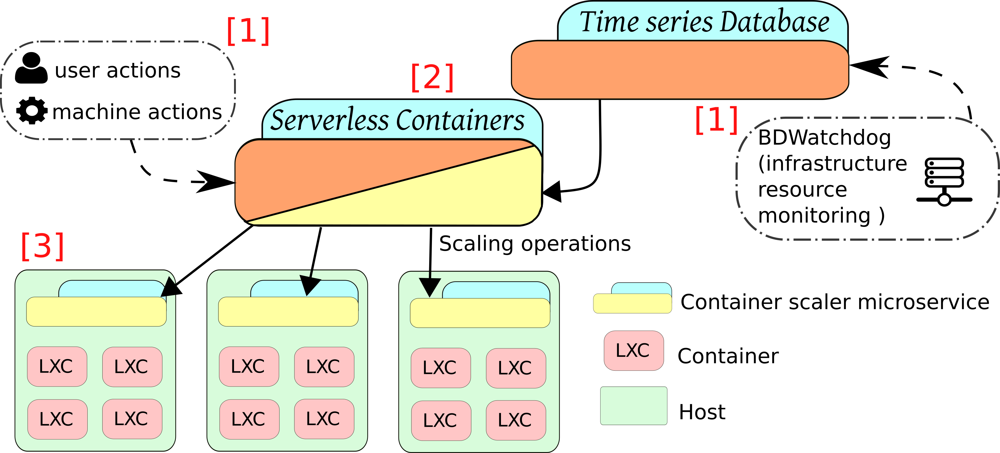
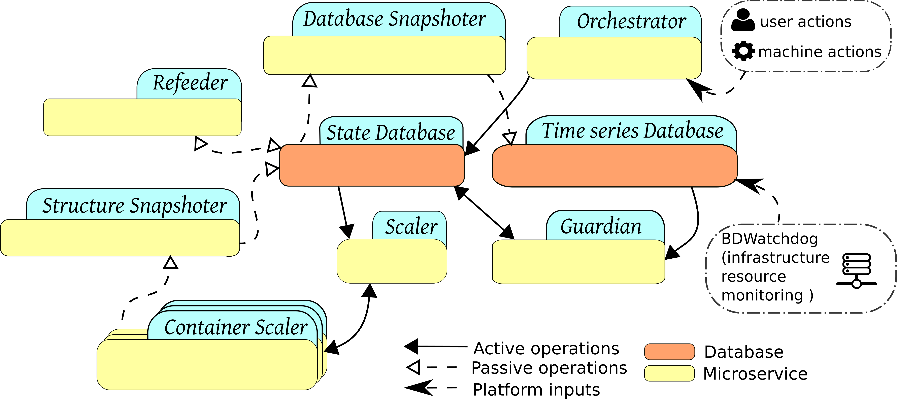
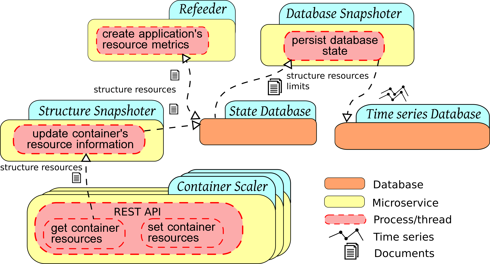

## High-level diagram 

This framework has been designed using a microservice approach in order
to ease its development as well as to create speciliazed units that can 
be reused or improved in isolation. In addition, by using this paradigm 
it is also possible to implement framework that inherently presents an 
internal parallelism that is useful when dealing with scenarios that 
require responsiveness, such as is the case with real-time and on-demand 
resource scaling.

The next image shows a high-level diagram of the scenario on which the 
framework is deployed:

* [1] Beginning with the framework's **inputs**, there are two: 
1) the actions, that control the framework's behavior, both performed 
by an user or by another program through the API; and, 
2) the resource monitoring time series, currently provided by an 
external framework ([BDWatchdog](https://bdwatchdog.readthedocs.io/en/latest/)), 
that are used in the policy decision for the resource scaling operations.

* [2] Continuing with the actual **serverlesss containers framework**, which 
groups several microservices, some of which are placed on the controlled 
hosts. The framework's inner workings are further specified on the 
following sections.

* [3] And finishing with the **controlled infrastructure**, which usually 
consists of several hosts running each one several containers. 
Currently only the containers backed by the cgroups file system are 
supported by design and, more specifically, Linux Containers (LXC) have 
been used and thus have been proven to work with this framewok. 

## Microservice architecture

As previously stated, the design followed to create the architecture of 
this framework uses several microservices that communicate and exchange 
information. The following image shows a high-level diagram of the 
microservices layout:

As it can be seen, the microservices can be separated into active and 
passive ones, with the difference being that the passive ones focus on 
feedback operations to keep the framework continuously updates on the
infrastructure's state, and the active ones that use such information to
change the state (the container's resource limits) accordingly as needed. 

### Passive Microservices

The passive microservices are needed to continuosly keep updated the 
central database (State Database) with all the metada that tracks the 
state of the infrastructure, from the number of containers and its 
thresholds to the allocated amounts of resources. 

Some passive microservices are used to create aggregated data for 
entities such as applications (i.e., representing a group of containers)
or to persist temporary information into a persistent database.

* **Structure Snapshoter**: Continuously polls the limits of the containers 
and writes that information into the State Database.
* **Database Snapshoter**: Forwards the information temporarily stored on the
State Database to a peristent database, thus creating time series. 
* **Refeeder Snapshoter**: Aggregates and creates new metadata from existing
one (e.g., allocated amount of CPU for an application composed of 3 containers)

### Active Microservices

The active microservices are the actual ones that perform the scaling
of the resources via changing the container resource limits on the 
underlying cgroups file system through a coordinated chain of events.

As described on the "Scaling policy" subsection of the "Use Case" section, 
in order to perform a scaling operation, the resource usage has to exceed
the upper, or drop below the lower limit (1). After a configured time amount 
has passed on this state, the **Guardian** microservice will create a scaling 
request (2) with the specific amount of resource to be changed. 
Such request will be picked up and processed by the **Scaler** (3) and 
applied accordingly (4).

More specific functionalities of the microservices are described next:

* **Guardian**: Working with time windows, it matches the real resource 
usages of the containers, as provided with the external resource monitoring, 
with the container limits stored on the State Database. As a result of 
the matches it generates scaling requests. 
* **Scaler**: Polls the State Database looking for requests to be applied to the
containers.

## Other/Common Microservices and Databases

Some microservices have an auxiliar role and are used both by active and 
passive microservices.

*  **Orchestrator**: Exposes an API that can be used both by humans or 
scripts to configure the framework.
* **Container Scaler**: This microservice has to be deployed on every 
infrastructure node whose hosted containers are to be scaled. This service
is able to read and write the crgoups file system to perform the actual 
resource limit scalings.

## More info

If what is described on this documentation webpage does not answer all of 
your doubts regarding the technical details, or simply is not enough for
you and you want the specifics, this framework has been published on a 
full-length 
[paper](https://www.sciencedirect.com/science/article/pii/S0167739X19310015) on the FGCS journal.
If you don't have access to the journal paper, you can still access the
preprint on this [link](http://bdwatchdog.dec.udc.es/articles/serverless_containers.pdf).
