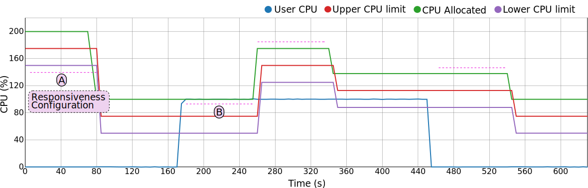

The scaling processes can be configured to better adapt to the needs of the
applications. Such configuration can be even changed dynamically if needed.

The configuration can also be divided between two dimensions, being the 
first the time dimension and the second one the resource limit dimension.
To better approach these two dimensions, the first one is referred to as
the Responsiveness of the framework, while the second one is referred to as
the Benevolence.

 

# Responsiveness

As its name implies, this configuration aspect of the framework dictates 
how fast the changes are made when it comes to adapting the resource 
limits to the application's real usage. The reason why we have to take 
into account this, instead of just performing instant scaling 
operations once the limits have been surpassed, lies behind the concept 
of hysteresis. 

If we consider hysteresis as the degree of variation of the resource 
usage patterns, we need to take into account some kind of time buffer 
before changing the resource limits. This time buffer allows to have 
some assurance that after a scaling operation, another one won't be 
needed soon after.

As seen on the image above, the responsiveness can be modulated 
differently to adapt to two possible scenarios:

* A: Time to pass before performing a **scaling down** operation.
* B: Time to pass before performing a **scaling up** operation.

It has to be noted the difference between the two. While on the **A** 
scenario we can allow more time to pass, as the resources are in the 
end being underutilized, so that the application is not being penalized, 
on the **B** scenario the application may be close to, or suffering a 
bottleneck, thus we may consider to shorten such times to avoid 
execution overheads.



To tune the Responsiveness of the framework, the request-generating Rules 
will have to be modified.

# Benevolence

In the case of Benevolence, as its name says, it modules how the 
framework addresses the scaling operations in terms of the number 
of resources that it takes away or that it gives. 

On the one hand, a 'benevolent' framework adjusts the resources leaving 
an ample margin between the limits so that the areas are large enough 
to accommodate any resource variations, while at the same time giving 
a large number of resources when scaling up.

On the other hand, if we want to push the serverless scenario to the 
limit we can set narrower boundaries and more restrained scaling up
operations. 

To module the behaviour between these two options, thus tuning the 
framework to behave closer to the traditional instance or closer to
the serverless paradign, we can use the following configuration 
parameters:

* 1) Scaling up amount. A fixed and configurable amount.
* 2) Scaling down policy. Although several are possible, to implement
the serverless scenario the only one usable is the 'fit to usage', which
looks to set resource limits so that the usage falls between the upper 
and lower boundaries.
* 3) Boundary amount. This parameter is used combined with the scaling 
down policy to define the final allocated resource limit.


To tune the Benevolence of the framework, mainly the amount parameter of 
the down-scaling Rules will have to be adapted.

# Rule configuration

As previously stated, in order to configure the framework on the vertical
and time dimensions, the Rule documents have to be modified.

To tune the Benevolence, we have to modify the request-generating Rules
to specify the amount of time windows desired before a scaling request
is generated by the 'Guardian'.

As seen in the next Rule document, the number of time windows where the
usage had to surpass the upper limits before one of this kind of requests 
is generated is 4. We can also notice that the number of the opposite 
events (usage fell below the lower limit) must also be lower than 2. This
is done in order to avoid hysteresis, skipping scenarios where the resource
usage is highly volatile and constantly crossing both limits.
```
CpuRescaleUp = dict(
    _id='CpuRescaleUp',
    type='rule',
    resource="cpu",
    name='CpuRescaleUp',
    rule=dict(
        {"and": [
            {">=": [
                {"var": "events.scale.up"},
                4]},
            {"<=": [
                {"var": "events.scale.down"},
                2]}
        ]}),
    events_to_remove=4,
    generates="requests",
    action={"requests": ["CpuRescaleUp"]},
    amount=75,
    rescale_by="amount",
    active=True
)
```

When it comes to Benevolence, we can also see on the previous Rule 
document that the amount of CPU increased on a scaling up operation will
be 75 shares.


Finally, in order to configure the boundary parameter, we have to use
the limits documents of each container. On these documents there is a 
boundary applied for each resource, as seen next:
```
{
    cpu: {
        boundary: 25,
        lower: 50,
        upper: 75
    }
}
```  

