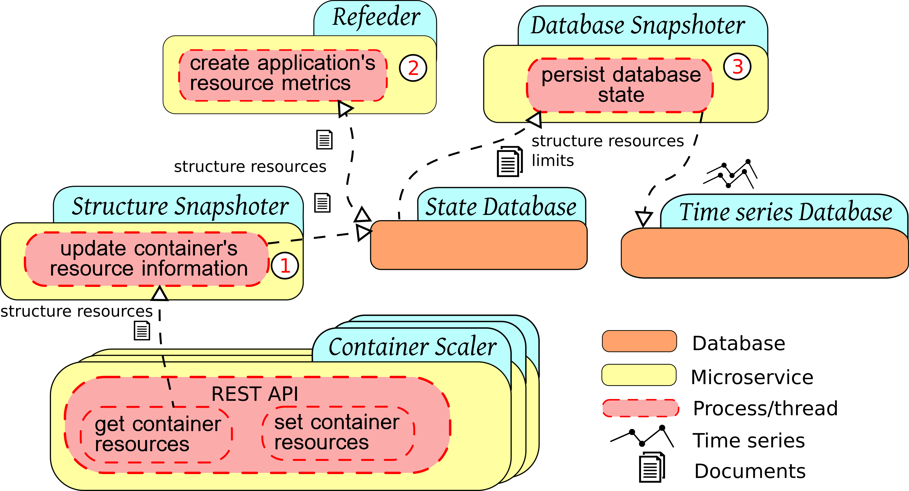
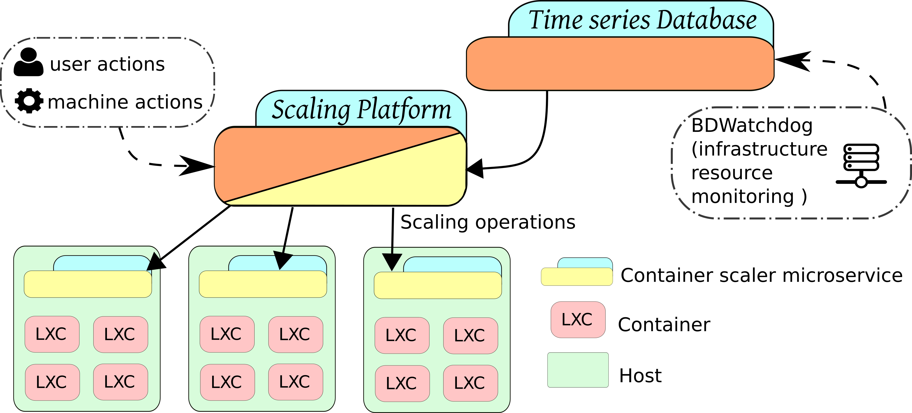

# Serverless Containers documentation

The Serverless Containers framewowork has been developed at Univerisade da Coruña, in Spain, as part of a PhD thesis from the candidate [Jonatan Enes](http://jonatanenes.com/).

This framework is able to dynamically scale the container's resources (e.g., CPU, Memory, disk and network) in order to adapt them to the real usage, at any moment and in real-time.

In this page all the documentation is presented for the several microservices that compose the framework.

* For a brief summary of this tool you can visit its [website](http://bdwatchdog.dec.udc.es/serverless/index.html).
* In order to see data from real experiments where this tool was used, you can visit [this demo](http://bdwatchdog.dec.udc.es/TimeseriesViewer_DEMO/).
* For the source code you can visit its [GitHub](https://github.com/JonatanEnes/ServerlessContainers).

## Architecture and microservices

## Documentation layout

    mkdocs.yml    # The configuration file.
    docs/
        index.md  # The documentation homepage.
        ...       # Other markdown pages, images and other files.
   

