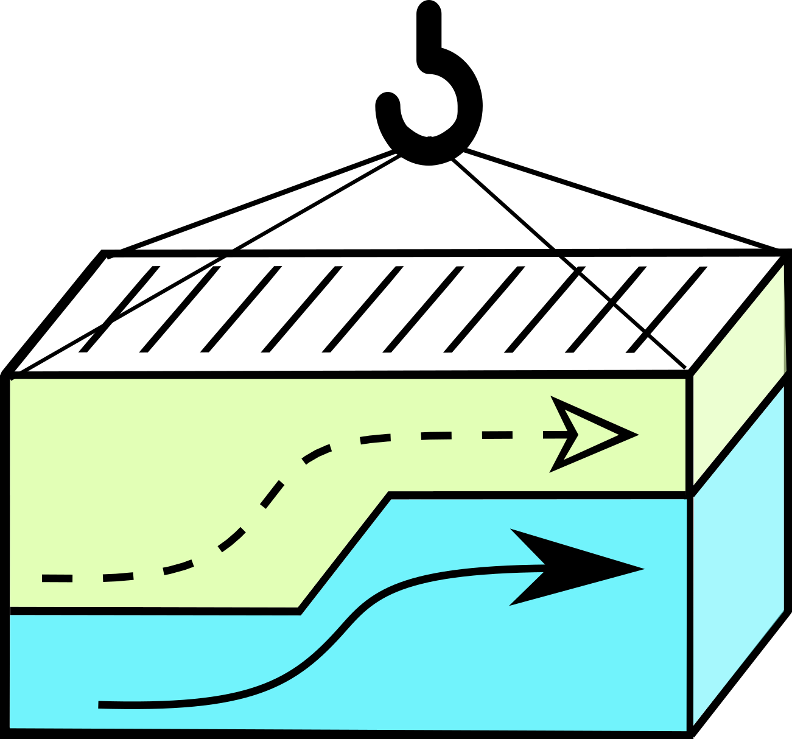

{: style="max-width:25%; margin-left: 40%"}

The Serverless Containers is able to **dynamically scale a container 
resource limit (_e.g., CPU, Memory, disk and network_) in order to 
adapt them to the real usage**, at any moment and in real-time.

* For a brief summary of this tool you can visit its 
[homepage](http://bdwatchdog.dec.udc.es/serverless/index.html) website.
* In order to see data from real experiments where this tool was used, 
you can visit [this demo](http://bdwatchdog.dec.udc.es/TimeseriesViewer_DEMO/).
* For the uncommented source code you can visit its 
[GitHub](https://github.com/JonatanEnes/ServerlessContainers).

Serverless Containers has also been the subject of a publication in 
**Future Generation Computer Systems (FGCS)**, which is available 
[online](https://www.sciencedirect.com/science/article/pii/S0167739X19310015).
([preprint](http://bdwatchdog.dec.udc.es/articles/serverless_containers.pdf))
In this publication the framework is thoroughly described with all technichal
detail, and several experiment examples are also presented.

This documentation webpage gives a more detailed description of the 
framework but without delving into technichal details as in the 
available publication. The webpage has been structured with the 
following sections:

1. [Use case](use_case.md): 
This section summarizes the core use case of this framework with a 
simple example.

2. [Architecture](architecture.md): 
Which briefly describes the architecture and design used.

3. [Deployment](deployment.md): 
In this section it is described how to deploy the framework overall. 
Some guidelines are also provided.

4. [Usage](usage.md):
In this section a quickstart guide is provided to show how two containers
would be supported and transitioned from a traditional resource management
to working with a serverless environment.

5. [Configuration](configuration.md):
In this section a few, key configuration parameters are explained.

6. [Source Code (external)](code/src/index.html): 
If you are interested on the low-level code and code documentation. 

7. [Sponsors](sponsors.md): 
Some comments on the backers and sponsors of this framework.