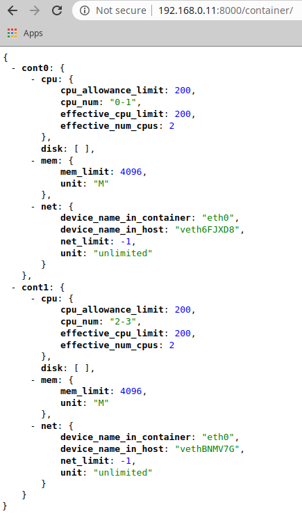
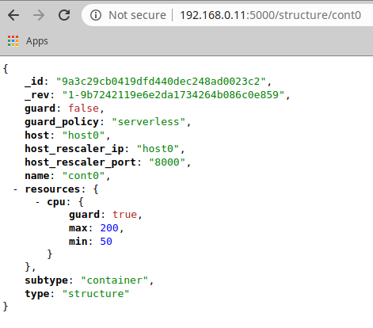

The **_Serverless Container framework_** has been developed to be 
modular at its core, meaning that it can be scaled and adapted to 
the number of hosts and containers present in the infrastructure, 
from a few containers on a single host to dozens of containers 
spanned across multiple hosts.

In order to show a quickstart with an example of usage, and keep it
simple, this scenario will use 2 containers deployed on 1 hosts, with 
CPU as the only scaled resource. We will also consider LXD as the 
technology used to deploy the containers, that the host *host0* is 
network-reachable using such name, and that a CouchDB database is 
running and accessible as *couchdb*. It is also required to have 
resource monitoring and a time series database.

The requirements are overall described on the [Deployment](/deployment/) 
Section.

## Container Scaler deployment

First, in order to make sure that the container are properly detected 
and supported, we have to make sure that the *Container Scaler* service
(deployed on every host) is running. 

To do so, you can deploy 2 containers using LXD (in this case spawning 
an Ubuntu 20.04 distro): 
```
lxc init ubuntu:20.04 cont0
lxc init ubuntu:20.04 cont1
lxc start cont0 cont1
```

Next, from the framework's folder, start the service:
```
bash scripts/services/start_node_rescaler.sh
```

To make sure that the containers are accessible to the service, you can 
open a web browser and point to the host's IP and the '8000' port and 
'/container' path. You should see something similar to:

 

As you can see, the memory, disks and network resources are also 
reported, but they will be ignored on this guide.


## Initializing the container's limit

As of now, the containers could have no limits applied (-1 value) or 
some predefined limits. Such resource limits can be easily changed 
through REST API calls to the *Container Scaler* service. We can do this 
with the 'curl' command:
```
curl -X PUT -H "Content-Type: application/json" -d '{"cpu": {"cpu_allowance_limit": "200","cpu_num": "0,1"}}' \ 
http://host0:8000/container/cont0
curl -X PUT -H "Content-Type: application/json" -d '{"cpu": {"cpu_allowance_limit": "200","cpu_num": "2,3"}}' \
http://host0:8000/container/cont1
```
Although the -d payload can also be taken from a .json file 
(see the 'NodeRescaler' folder contents).

However, it has to be note that this out-of-band limit changing operation 
is only intended for initializations or hard and direct limit changes for 
experimentation reasons, for example. 


## Initializing State Database

In order to continue with the guide, and before initializing the 
remaining microservices, we have to initialize the *State Database*. 
This is needed considering that the services are configured and tuned 
via unique documents stored on such *StateDatabase*. This allows to 
change their configuration on-the-fly. 

To perform this initialization, you can use Python scripts that connect 
to the database and insert the proper documents, as pre-configured by 
the user.

To initialize the services with their respective configuration files:
```
python3 quickstart/StateDatabase/services.py
```

To initialize the rules that will govern the rescaling policies, as well 
as the events and requests databases, run:
```
python3 quickstart/StateDatabase/events_and_requests.py
python3 quickstart/StateDatabase/rules.py
```

Finally, in order to initialize the containers and the hosts, as well as
the container's limit thresholds, run: 
```
python3 quickstart/StateDatabase/limits.py
python3 quickstart/StateDatabase/structures.py
```

## Start the Orchestrator
In order to check that the previous step finished correctly and that all
of the necessary documents were stored on the *State Database*, you can 
use the *Orchestrator* service as it exposes an API of the database 
contents. Start it with:
```
bash scripts/services/start_orchestrator.sh
```

And then check its output by opening a browser with the instance's IP on 
which the Orchestrator was started, the port '5000' and the path 
'/structure/cont0' (to see the cont0 structure document). You should see
something similar to:

 

As you can see, the container is registered with resource limits of 50 
and 200 for the minimum and maximum values, respectively. It can also 
be appreciated that its configuration marks it as a non-scalable container
(*guard:false*), even though the CPU is marked as subjected to be scaled.

The full *Orchestrator* API can be checked below and it can be 
used via scripts that perform REST calls.

Using this service and the scripts, we will make sure that both of the 
containers are set to be left unscaled (unguarded):
```
bash scripts/Orchestrator/Structures/set_to_unguarded.sh cont0
bash scripts/Orchestrator/Structures/set_to_unguarded.sh cont1
```
A return code of 201 ensures that the operation was carried out 
correctly. 

## Starting the services

Now that the containers are up and running and that the *State Database* 
has been initialized, the remaining microservices can also be started.

First, the passive services should be started (tmux is used to de-attach 
the program from the terminal and keep the service running):
```
tmux new -d -s "DatabaseSnapshoter" "source set_pythonpath.sh; python3 src/Snapshoters/DatabaseSnapshoter.py"
tmux new -d -s "StructureSnapshoter" "source set_pythonpath.sh; python3 src/Snapshoters/StructuresSnapshoter.py"
```
Both of these services show an output each time they finish a polling 
operation. The polling time can be configured with their respective 
configuration documents.

Secondly, the active services can be started:
```
tmux new -d -s "Guardian" "source set_pythonpath.sh; python3 src/Guardian/Guardian.py"
tmux new -d -s "Scaler" "source set_pythonpath.sh; python3 src/Rescaler/ClusterScaler.py"
```
These services also output what they are doing, processing time windows 
with a time length that is configurable.

At this point, all of the necessary services would be running, however,
nothing would be happenning as both of the containers are in un 
'unguarded' state, that is, they are being left untouched.

We will also deactivate the *Scaler* service for now:
```
curl -s -X PUT -H "Content-Type: application/json" http://orchestrator:5000/service/scaler/ACTIVE -d '{"value":"false"}'
```

## Transitioning the containers to serverless instances 

In order to move the containers from following the resource management 
of a **traditional instance**, that is, having the initial resources 
fixed throughout their lifecycle, into a **serverless environment**, 
we can use the same scripts as before:
```
bash scripts/Orchestrator/Structures/set_to_guarded.sh cont0
bash scripts/Orchestrator/Structures/set_to_guarded.sh cont1
```
Now, both container are being monitored by the *Guardian* service and 
their CPU limits will be scaled according to their internal CPU usage.

However, the *Guardian* service will only create Requests for resource 
scaling, either to lower or increase them, but not actual changes will 
be made to the resource's limits.

In order to apply the Requests as generated by the *Guardian* service,
we will have to rely on the *Scaler* service. In order to let it work, 
we will now activate it:
```
curl -s -X PUT -H "Content-Type: application/json" http://orchestrator:5000/service/scaler/ACTIVE -d '{"value":"true"}'
```

Now, with all of the services properly working, the serverless 
environment should be fully functional for the containers.

As seen in the next image, a serverless policy is being applied to the 
container as its resources are being continuously modified according to
the resource usage:

* 1) In the beginning, the CPU is idle so that after enough time passes 
with the CPU underused, a scaling down operation is performed.
* 2) Later, the CPU is suddenly heavily used to the point that a 
bottleneck occurs. To fix this, a scaling up operation is performed. 
* 3) However, after increasing the resources, the upscale operations gave
too many resources and now there is another under-utilization scenario. 
A second scaling down operation is performed to adjust them.
* 4) The usage fits perfectly between the lower and upper limits so it
is under control.
* 5) Finally, the CPU is idle again so that a last scaling down 
operation is carried out, leaving the allocated resources to the 
theoretical minimum (minimum + 2 x boundary).

 

The behavior exposed on the image can be configured and tuned with a few,
critical parameters, as explained on the [Configuration](/configuration/) 
Section.

## Returning the containers to traditional instances

If at any moment we want to stop the scaling from taking place for 
these containers, we have only to configure the containers to be left 
alone (unguarded):
```
bash scripts/Orchestrator/Structures/set_to_unguarded.sh cont0
bash scripts/Orchestrator/Structures/set_to_unguarded.sh cont1
```

If at this point we consider that the resource limits are too low, we 
can always reset them. 


## Shutting everything down 

In order to shut everything down we only have to stop the Python 
programs running the microservices. 

However, it has to be noted that it is possible to implement a 'partial'
shut down of the system by only stopping the active services. Even 
further, the system can be inactivated by only stopping or de-activating 
the *Scaler* microservice, something that we effectively did at the end 
of the [Starting the services](/quickstart/#starting-the-services) subsection.

## Orchestrator's API

* "/service/" ['GET']
* "/service/<service_name\> ['GET']
* "/service/<service_name\> ['PUT']
* "/service/<service_name\>/<key\> ['PUT']
* "/rule/ ['GET']
* "/rule/<rule_name> ['GET']
* "/rule/<rule_name>/activate ['PUT']
* "/rule/<rule_name>/deactivate ['PUT']
* "/structure/ ['GET']
* "/structure/<structure_name> ['GET']
* "/structure/<structure_name\>/resources ['GET']
* "/structure/<structure_name\>/resources/<resource\> ['GET']
* "/structure/<structure_name\>/resources/<resource\>/<parameter\> ['GET']
* "/structure/<structure_name\>/resources/<resource\>/<parameter\> ['PUT']
* "/structure/<structure_name\>/guard ['PUT']
* "/structure/<structure_name\>/unguard ['PUT']
* "/structure/<structure_name\>/resources/<resource\>/guard ['PUT']
* "/structure/<structure_name\>/resources/<resource\>/unguard ['PUT']
* "/structure/<structure_name\>/resources/guard ['PUT']
* "/structure/<structure_name\>/resources/unguard ['PUT']
* "/structure/<structure_name\>/limits ['GET']
* "/structure/<structure_name\>/limits/<resource\> ['GET']
* "/structure/<structure_name\>/limits/<resource\>/boundary ['PUT']
* "/structure/<structure_name\>/guard_policy/serverless ['PUT']
* "/structure/<structure_name\>/guard_policy/fixed ['PUT']
* "/heartbeat ['GET']


