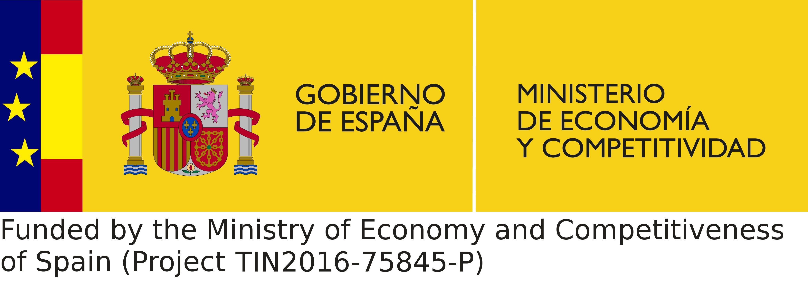

# Sponsors

The **Serverless Containers** framework has been developed as part of 
a PhD thesis from the candidate [Jonatan Enes](http://jonatanenes.com/).

This frameworks uses another in-house made framework, 
[BDWatchdog](https://bdwatchdog.readthedocs.io/en/latest/),
for the resource monitoring requirement, and is in turn used for a 
specific experimentation scenario for the energy control and capping of
containers [more info](http://bdwatchdog.dec.udc.es/energy/index.html).

This PhD thesis is currently being carried out at Universidade da 
Coruña (Spain), in the Computer Architecture group of the Computer 
Engineering department.   

[{: style="max-width:40%;"}](http://gac.udc.es/english/)
[{: style="max-width:40%;margin-left:10%; margin-bottom: 1%;"}](http://www.udc.es/index.html?language=en)

Finally, this work has also been possible thanks to the collaboration 
and funding of several organizations as next presented:

[{: style="max-width:40%; margin-bottom:3%; "}](http://www.mineco.gob.es)
{: style="max-width:40%; margin-left:10%; "}

