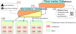

This framework has been designed using a microservice approach in order
to ease its development as well as to create specialized units that can 
be reused or improved in isolation. In addition, by using this development 
technique it is also possible to implement a framework that inherently 
presents an internal parallelism that is useful when dealing with 
scenarios that require responsiveness, such as is the case with 
real-time and on-demand resource scaling.

The next image shows a high-level diagram of the scenario on which the 
framework is deployed:

* The framework's **inputs**, there are two: 
     * [1] the actions that control the framework's behavior, both performed 
     by a user or by another program through the framework's API.
     * [2] the resource monitoring time series, currently provided by an 
    external framework ([BDWatchdog](http://bdwatchdog.dec.udc.es/monitoring/index.html)), 
    that are used in the policy decision for the resource scaling operations.

* The **_Serverless Containers framework_** [3], 
that groups several microservices, some of which are placed on the 
controlled hosts. The microservices' inner workings are further 
specified next.

* The **controlled infrastructure** [4], which usually 
consists of several hosts running one or several containers each. 
Currently, only the containers backed by the cgroups file system are 
supported by design and, more specifically, Linux Containers (LXC) have 
been used and thus have been proven to work with this framework. 

## Microservice architecture

As previously stated, the design followed to create the architecture of 
this framework uses several microservices that communicate and exchange 
information. The following image shows a high-level diagram of the 
microservices layout:

As it can be seen, the microservices can be separated into **active** and 
**passive** ones, with the difference being that the passive ones focus on 
feedback operations to keep the framework continuously updated on the
infrastructure's state, while the active ones use such information 
to scale the container's resource limits accordingly and as needed. 

### Passive Microservices

The passive microservices are needed to continuously keep the central 
database (State Database) updated with all the metadata that tracks the 
state of the infrastructure, from the number of containers and their 
thresholds to the allocated amounts of resources.

Some passive microservices are used to create aggregate data for 
entities such as applications (i.e., representing a group of containers)
or to persist temporary information into a persistent database.

* **Structure Snapshoter**: Continuously polls the actually applied 
limits of the containers and writes that information into the State 
Database.
* **Database Snapshoter**: Forwards the information temporarily stored 
on the State Database to a persistent database, thus creating time series. 
* **Refeeder Snapshoter**: Aggregates and creates new metadata from 
existing one (e.g., allocated amount of CPU for an application composed 
of 3 containers).

### Active Microservices

The active microservices are the actual ones that perform the scaling
of the resources via changing the container resource limits on the 
underlying cgroups file system through a coordinated chain of events.
The events that trigger these changes are specified according to the 
policy used.

[comment]: <> (As described on the [Scaling policy]&#40;/use_case/#scaling-policy&#41; )
[comment]: <> (subsection of the [Use Case]&#40;/serverless_policy&#41; section, in order to perform a )
[comment]: <> (scaling operation, the resource usage has to exceed the upper, or drop )
[comment]: <> (below the lower limit &#40;1&#41;. After a configured time amount has passed on )
[comment]: <> (this state, the **Guardian** microservice will create a scaling request )
[comment]: <> (&#40;2&#41; with the specific amount of resource to be changed. Such request )
[comment]: <> (will be picked up and processed by the **Scaler** &#40;3&#41; and then, applied )
[comment]: <> (accordingly &#40;4&#41;.)

More specific functionalities of the microservices are described next:

* **Guardian**: Working with time windows, it matches the real resource 
usages of the containers, as provided with the external resource monitoring, 
with the container limits stored on the State Database. As a result of the matches 
it generates scaling requests. Mainly used with the serverless policy.

* **Scaler**: Polls the State Database looking for requests to be applied to the containers.

### Other Microservices

Some microservices have an auxiliary role and are used both by active and 
passive microservices.

* **Orchestrator**: Exposes an API that can be used both by humans or other programs 
to configure the framework.

* **Container Scaler**: This microservice has to be deployed on every 
infrastructure node whose hosted containers are to be scaled by any policy. 
This service is able to read and write the cgroups file system to perform 
the actual resource limit scaling operations.
