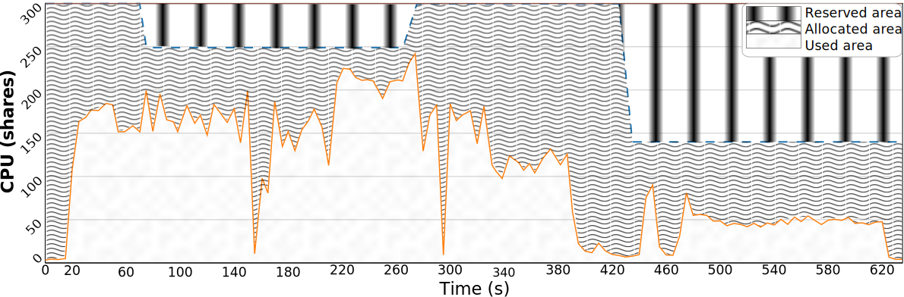
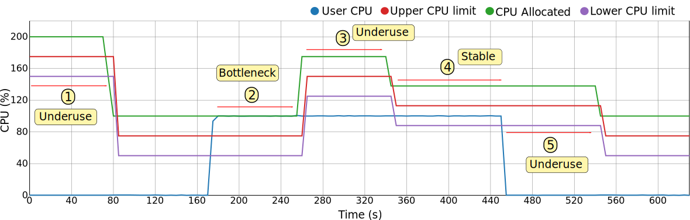

This framework is used to **scale** the **resources** of a **container**, 
or a group of containers, both **dynamically and in real time**, so that 
the limits placed on such resources can evolve over time. If we want to
implement a serverless environment, then such resource limits will have to 
change to be placed just above the usage. 

On the one hand, from a traditional **virtual machine** and **Cloud** 
perspective, this approach is similar to the on-demand and pay 
per usage resource provisioning, with the main difference being that on 
this case, the limits can be changed multiple times during execution 
instead of being specified only once at the instantiation phase.

On the other hand, this approach is also really close to the 'original' 
**serverless** paradigm, as the container and all the processes running on 
it can not trust the pool of resources exposed to them. Such resources limits 
can vary according to the usage the containers make fo them (e.g., if 
the CPU usage increases, the CPU limit should also be raised via adding more cores).

Combining both of these approaches, this framework comes up with a policy 
so that that software containers (e.g., LXC, Docker), can benefit 
from having a resource management that implements a serverless scenario. 

Among other perks, the main benefits of this framework and of using the
serverless policy include:

* **Higher resource utilization**. If the containers have a low resource 
usage, they are given a smaller set of resources. If they have a higher 
usage, they are given a larger set. This allows to provision the resources
more efficiently and increase their utilization ratio (used / allocated).

* **Pay per 'real' usage billing policy**, only the used resources are 
considered when billing, and by used we mean the actually consumed by the 
containers, not the allocated ones.

* **Flexibility of the containers**. Considering that containers can be highly similar 
to virtual machines when it comes to the virtualization environment exposed, they can 
be used to deploy a wider range of applications if compared to more traditional 
serverless solutions.

## Objective

The main objective of this policy is to adjust the resource limit, that 
is, the amount of a resource that a container is given, so that such 
limit is not far away of the real resource usage. If such limit is way 
higher than the usage, we can talk of an **underutilized** resource 
scenario, while if the limit is close to the usage, there is a 
**bottleneck**.

When using this policy, the framework makes a best-effort to keep a 
balance between both scenarios, as if the **allocated** amount of 
resource is set too close to the usage, any unexpected increase will 
face a bottleneck, while if set too high, all the unused amount is 
lost considering that in the serverless paradigm only the **used 
resources** are billed.


## How the policy works

In order to better see how this policy achieves its goal, we can study an 
example of several scaling operations taking place on a time window.


First, in the image it can be seen that there are:

* A time series that varies (_orange_), this time series represents the 
container **aggregated resource usage**, in this case of CPU.
* Three varying thresholds (_dashed lines_), which, from top to bottom, 
represent the resource **allocated amount** and the upper and lower 
**boundaries** (more on this later).
* Three colored areas (_blue_, _green_ and _ochre_), which represent the areas
between the previously mentioned thresholds.
* Two horizontal lines that do not vary, which represent the resource
**maximum** and **minimum limits**. The maximum would be equivalent to the 
initial allocated resources on a traditional instance, while the minimum 
would represent the least amount of resources that we will grant the 
container.

As previously stated, the **_Serverless Containers_** framework looks 
for a balance when it comes to setting an appropriate allocated resource 
amount, continuously responding to the resource usage variations. 
Such response can be seen in the several scaling operations that take 
place, such as at seconds 70 (down), 270 (up) and 420 (down). 

In order to detect the conditions that trigger these scaling 
requirements, two limits (or boundaries) are used:

* **Upper limit**, which defines a threshold that, once surpassed, 
signals for a need to scale up the allocated resource limit to avoid any 
future bottleneck.
* **Lower limit**, which triggers a scale down of the allocated 
resource amount once the usage falls below the boundary.

Thus, it is easy to see that if the thresholds are considered, the 
first and third scaling operations were caused because the resource 
usage fell under the lower boundary, while the second was caused because 
it surpassed the upper boundary.
 
### Resource utilization

It is interesting to note how important it is to keep a balance that 
does not impose a bottleneck but also stays close to the real resource 
usage. As previously stated, the serverless paradigm differs from the 
Cloud IaaS paradigm in that the resource limits can be modified 
multiple times over time, instead of just defining such limit once at 
the startup. 

Moreover, if we consider that the user of a serverless platform 
typically does not specify such resource requirements and that
the billed resources are only the used ones, the task of properly 
scaling and setting limits becomes a crucial one which falls to 
the provider.

Because of these reasons it is important to define a key ratio, the 
**resource utilization**, which can be easily obtained from the amount of 
used and the allocated resources. The next image shows the previously 
used time window but with areas as the focus of the study.



We can see that there are three areas:

* **Used area** (_dots_), which represents the amount of resources 
used by the container.
* **Allocated area** (_waves_), representing the changing amount of 
resources assigned to this container via the scaling operations.
* **Reserved area** (_stripes_), which represents the theoretical 
limit of resources that the container had at any moment. It is worth 
noting that this area would effectively represent the resource 
footprint of a virtual machine whose resources are allocated and never 
changed.

With these areas it is easy to see that the ratio of utilization of 
this serverless framework would be higher than the one achieved by a 
traditional instance. Moreover, an ideal serverless platform, 
which allocates only the strictly needed resources at any moment, 
performing instantaneous scaling operation, would have a ratio of 100% 
(best-case scenario), while the ratio exposed by not performing any 
scaling operation, such as with the traditional instance, would be 
the worst-case scenario.


## Quickstart

The **_Serverless Container framework_** has been developed to be 
modular at its core, meaning that it can be scaled and adapted to 
the number of hosts and containers present in the infrastructure, 
from a few containers on a single host to dozens of containers 
spanned across multiple hosts.

In order to show a quickstart with an example of usage, and keep it
simple, this scenario will use 2 containers deployed on 1 host, with 
CPU as the only scaled resource. We will also consider LXD as the 
technology used to deploy the containers, that the host *host0* is 
network-reachable using such name, and that a CouchDB database is 
running and accessible as *couchdb*. It is also required to have 
resource monitoring and a time series database.

The requirements are overall described on the [Deployment](/deployment/) 
Section.

### Container Scaler deployment

First, in order to make sure that the containers are properly detected 
and supported, we have to make sure that the *Container Scaler* service
(deployed on every host) is running. 

To do so, we can deploy 2 containers using LXD (in this case spawning 
an Ubuntu 20.04 distro): 
```
lxc init ubuntu:20.04 cont0
lxc init ubuntu:20.04 cont1
lxc start cont0 cont1
```

Next, from the framework's folder, start the service:
```
bash scripts/services/start_node_rescaler.sh
```

To make sure that the containers are accessible to the service, you can 
open a web browser and point to the host's IP and the '8000' port and 
'/container' path. You should see something similar to:

 

As you can see, the memory, disks and network resources are also 
reported, but they will be ignored on this guide.


### Initializing the container's limit

As of now, the containers could have no limits applied (-1 value) or 
some predefined limits. Such resource limits can be easily changed 
through REST API calls to the *Container Scaler* service. We can do this 
with the 'curl' command:
```
curl -X PUT -H "Content-Type: application/json" -d '{"cpu": {"cpu_allowance_limit": "200","cpu_num": "0,1"}}' http://host0:8000/container/cont0
curl -X PUT -H "Content-Type: application/json" -d '{"cpu": {"cpu_allowance_limit": "200","cpu_num": "2,3"}}' http://host0:8000/container/cont1
```
Although the -d payload can also be taken from a .json file 
(see the 'NodeRescaler' folder contents).

However, it has to be note that this out-of-band limit changing operation 
is only intended for initializations or hard and direct limit changes for 
experimentation reasons, for example. 


### Initializing State Database

In order to continue with the guide, and before initializing the 
remaining microservices, we have to initialize the *State Database*. 
This is needed considering that the services are configured and tuned 
via unique documents stored on such *StateDatabase*. This allows to 
change their configuration on-the-fly. 

To perform this initialization, you can use Python scripts that connect 
to the database and insert the proper documents, as pre-configured by 
the user.

To initialize the services with their respective configuration files:
```
python3 quickstart/StateDatabase/services.py
```

To initialize the rules that will govern the rescaling policies, as well 
as the events and requests databases, run:
```
python3 quickstart/StateDatabase/events_and_requests.py
python3 quickstart/StateDatabase/rules.py
```

Finally, in order to initialize the containers and the hosts, as well as
the container's limit thresholds, run: 
```
python3 quickstart/StateDatabase/limits.py
python3 quickstart/StateDatabase/structures.py
```

### Start the Orchestrator
In order to check that the previous step finished correctly and that all
of the necessary documents were stored on the *State Database*, you can 
use the *Orchestrator* service as it exposes an API of the database 
contents. Start it with:
```
bash scripts/services/orchestrator/start_tmux.sh
```

And then check its output by opening a browser with the instance's IP on 
which the Orchestrator was started, the port '5000' and the path 
'/structure/cont0' (to see the cont0 structure document). You should see
something similar to:

 

As you can see, the container is registered with resource limits of 50 
and 200 for the minimum and maximum values, respectively. It can also 
be appreciated that its configuration marks it as a non-scalable container
(*i.e., guard:false*), even though the CPU is marked as subjected to be scaled.

The full *Orchestrator* API can be checked below and it can be 
used via scripts that perform REST calls.

Using this service and the scripts, we will make sure that both of the 
containers are set to be left unscaled (unguarded):
```
bash scripts/orchestrator/Structures/set_to_unguarded.sh cont0
bash scripts/orchestrator/Structures/set_to_unguarded.sh cont1
```
A return code of 201 ensures that the operation was carried out 
correctly. 

### Starting the services

Now that the containers are up and running and that the *State Database* 
has been initialized, the remaining microservices can also be started.

First, the passive services should be started (tmux is used to de-attach 
the program from the terminal and keep the service running):
```
bash scripts/services/database_snapshoter/start_tmux.sh
bash scripts/services/structure_snapshoter/start_tmux.sh
```
Both of these services show an output each time they finish a polling 
operation. The polling time can be configured with their respective 
configuration documents.

Secondly, the active services can be started:
```
bash scripts/services/guardian/start_tmux.sh
bash scripts/orchestrator/Guardian/activate_guardian.sh
bash scripts/services/scaler/start_tmux.sh
```
These services also output what they are doing, processing time windows 
with a time length that is configurable.

At this point, all of the necessary services would be running, however,
nothing would be happening as both of the containers are in an 
'unguarded' state, that is, they are being left untouched.

We will deactivate the *Scaler* service for now:
```
bash scripts/orchestrator/Scaler/deactivate_scaler.sh
```

### Transitioning the containers to serverless instances 

In order to move the containers from following the resource management 
of a **traditional instance**, that is, having the initial resources 
fixed throughout their life-cycle, into a **serverless environment**, 
we can use the same scripts as before:
```
bash scripts/orchestrator/Structures/set_to_guarded.sh cont0
bash scripts/orchestrator/Structures/set_to_guarded.sh cont1
```
Now, both container are being monitored by the *Guardian* service and 
their CPU limits will be scaled according to their internal CPU usage.

However, the *Guardian* service will only create Requests for resource 
scaling, either to lower or increase them, but not actual changes will 
be made to the resource's limits.

In order to apply the Requests as generated by the *Guardian* service,
we will have to rely on the *Scaler* service. To let it work, 
we will now activate it:
```
bash scripts/orchestrator/Scaler/activate_scaler.sh
```

Now, with all of the services properly working, the serverless 
environment should be fully functional for the containers.

As seen in the next image, a serverless policy is being applied to the 
container as its resources are being continuously modified according to
the resource usage:

* 1) In the beginning, the CPU is idle so that after enough time passes 
with the CPU underused, a scaling down operation is performed.
* 2) Later, the CPU is suddenly heavily used to the point that a 
bottleneck occurs. To fix this, a scaling up operation is performed. 
* 3) However, after increasing the resources, the upscale operations gave
too many resources and now there is another under-utilization scenario. 
A second scaling down operation is performed to adjust them.
* 4) The usage fits perfectly between the lower and upper limits so it
is under control.
* 5) Finally, the CPU is idle again so that a last scaling down 
operation is carried out, leaving the allocated resources to the 
theoretical minimum (minimum + 2 x boundary).

 

The behavior exposed on the image can be configured and tuned with a few,
critical parameters, as explained on the [Configuration](/configuration/) 
Section.

### Returning the containers to traditional instances

If at any moment we want to stop the scaling from taking place for 
these containers, we have only to configure the containers to be left 
alone (unguarded):
```
bash scripts/orchestrator/Structures/set_to_unguarded.sh cont0
bash scripts/orchestrator/Structures/set_to_unguarded.sh cont1
```

If at this point we consider that the resource limits are too low, we 
can always reset them. 


### Shutting everything down 

In order to shut everything down we only have to stop the Python 
programs running the microservices. 

However, it has to be noted that it is possible to implement a 'partial'
shut down of the system by only stopping the active services. Even 
further, the system can be inactivated by only stopping or de-activating 
the *Scaler* microservice, something that we effectively did at the end 
of the [Starting the services](/quickstart/#starting-the-services) subsection.


## Configuration

The behavior of the **_Serverless Container_** framework can be 
configured to better adapt to the needs of the applications. Such 
configuration can be even changed dynamically if needed thanks to the 
design choices.

The configuration can be divided between two dimensions, being the 
first the **time dimension** and the second one the **resource limit 
dimension**. To better approach these two dimensions, the first one 
is referred to as the **Responsiveness** of the framework, while the 
second one is referred to as the **Benevolence**.

 

### Responsiveness

As its name implies, this configuration aspect of the framework dictates 
**how fast the changes are made** when it comes to adapting the resource 
limits to the application's real usage. The reason why we have to take 
into account this, instead of just performing instant scaling 
operations once the limits have been surpassed, lies behind the concept 
of hysteresis. 

If we consider hysteresis as the degree of variation of the resource 
usage patterns, we need to take into account some kind of time buffer 
before changing the resource limits. This time buffer allows to have 
some assurance that after a scaling operation, another one won't be 
needed soon after.

As seen on the image below, the responsiveness can be modulated 
differently to adapt to two possible scenarios:

* A: Time to pass before performing a **scaling down** operation.
* B: Time to pass before performing a **scaling up** operation.

It has to be noted the difference between the two. While on the **A** 
scenario we can allow more time to pass, as the resources are in the 
end being underutilized (the application is not being penalized), 
on the **B** scenario the application may be close to, or suffering a 
bottleneck, thus we may consider to shorten such times to avoid 
execution overheads.


To tune the Responsiveness of the framework, the request-generating 
Rules will have to be modified.

### Benevolence

In the case of Benevolence, as its name says, it modules how the 
framework addresses the **scaling operations** in terms of the **number 
of resources** that it takes away or that it gives. 

On the one hand, a 'benevolent' framework adjusts the resources leaving 
an ample margin between the limits so that the areas are large enough 
to accommodate any resource variations, while at the same time giving 
a large number of resources when scaling up.

On the other hand, if we want to push the serverless scenario to the 
limit we can set narrower boundaries and more restrained scaling up
operations. 

As it can be seen on the image below, to module the behaviour between 
these two options, thus tuning the framework to behave closer to the 
traditional instance or closer to the serverless paradigm, we can use 
the following configuration parameters:

* 1) **Scaling up amount**. A fixed and configurable amount.
* 2) **Scaling down policy**. Although several are possible, to implement
the serverless scenario the only one usable is the 'fit to usage', which
looks to set resource limits so that the usage falls between the upper 
and lower boundaries (stable area).
* 3) **Boundary amount**. This parameter is used combined with the 
scaling down policy to define the final allocated resource limit.


To tune the Benevolence of the framework, mainly the amount parameter of 
the down-scaling Rules will have to be adapted.

### Rule configuration

As previously stated, in order to configure the framework on the vertical
and time dimensions, the **Rule documents** have to be modified.

To tune the **Responsiveness**, we have to modify the request-generating 
Rules to specify the **amount of time windows** desired before a scaling 
request is generated by the *Guardian*.

As seen in the next Rule document, the number of time windows where the
usage had to surpass the upper limits before one of this kind of 
requests is generated is 4. We can also notice that the number of the 
opposite event (usage fell below the lower limit) must also be lower 
than 2. This is done in order to avoid hysteresis, skipping scenarios 
where the resource usage is highly volatile and constantly crossing 
both limits.
```
CpuRescaleUp = dict(
    _id='CpuRescaleUp',
    type='rule',
    resource="cpu",
    name='CpuRescaleUp',
    rule=dict(
        {"and": [
            {">=": [
                {"var": "events.scale.up"},
                4]},
            {"<=": [
                {"var": "events.scale.down"},
                2]}
        ]}),
    events_to_remove=4,
    generates="requests",
    action={"requests": ["CpuRescaleUp"]},
    amount=75,
    rescale_by="amount",
    active=True
)
```

When it comes to **Benevolence**, we can also see on the previous Rule 
document that the **amount of CPU increased** on a scaling up operation 
will be 75 shares (i.e., three-quarters of a core).

Finally, in order to configure the **boundary** parameter, we have to 
use the Limits documents of each container. On these documents there is 
a boundary applied for each resource, as seen next:
```
{
    cpu: {
        boundary: 25,
        lower: 50,
        upper: 75
    }
}
```  

### Service configuration

As previously stated, most of the microservices work with polling time 
windows. The relation between all of the services' time windows may be
important, although the framework has been designed to be robust and
tend for a behavior akin to an eventual consistency. The next image 
describes such relationships:


Nevertheless, both the *Guardian* and the *Scaler* time window 
configuration may be worth mentioning:

* **Guardian** : In this case, the time window directly influences the
Responsiveness of the framework, as previously seen the scaling 
operations are performed by measuring the number of time windows that
the resource usage spends on one specific scenario.
* **Scaler** : When it comes to the *Scaler* service, it is important 
that its polling time window is lower than the *Guardian* service one, 
as otherwise the Requests could be applied in an unordered fashion.

